# 博文学堂 V1 - 数据流转与流程图

## 1. 文档信息

- **关联项目**：博文平台
- **关联需求**：需求文档v1.md
- **关联库表**：数据库设计文档.md / sql/schema.sql
- **版本号**：V1.0
- **日期**：2026.5.07

---

## 2. 系统整体数据流转图

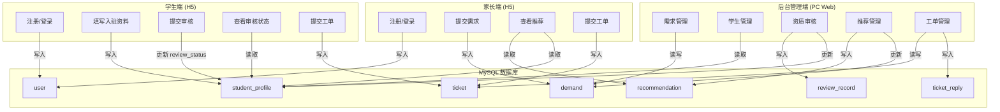

---

## 3. 核心业务流程图

### 3.1 用户注册与登录流程

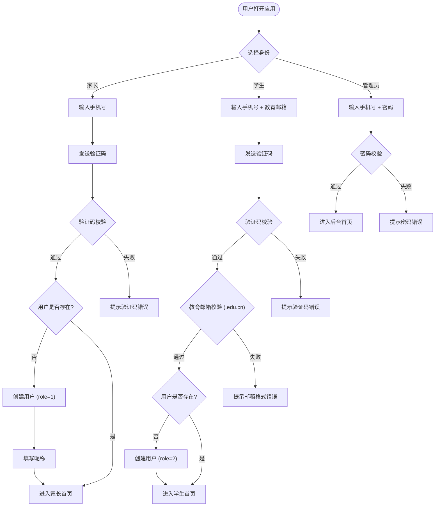

---

### 3.2 家长提交需求流程

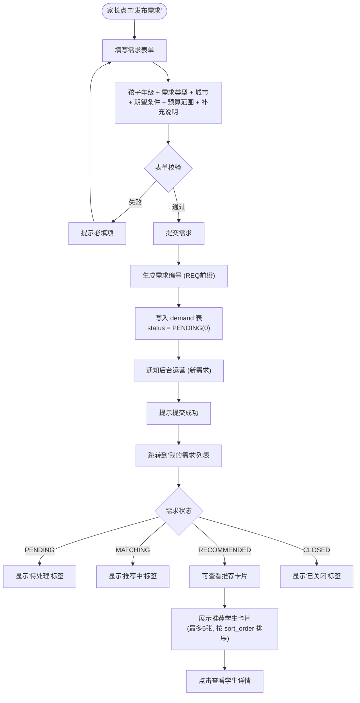

---

### 3.3 学生入驻与审核流程

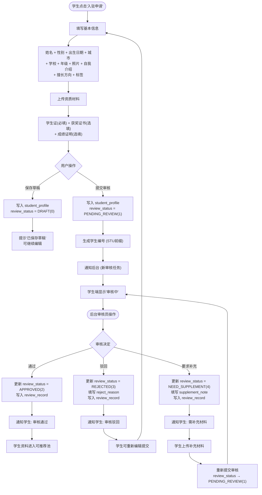

---

### 3.4 后台推荐匹配流程

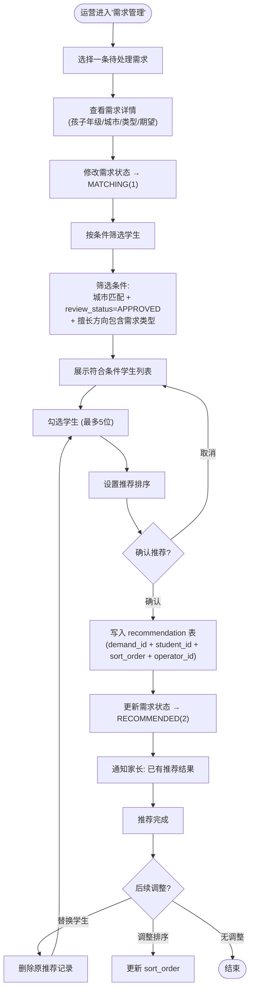

---

### 3.5 咨询工单处理流程

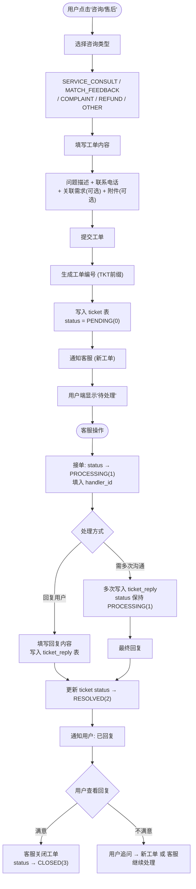

---

### 3.6 学生审核状态机

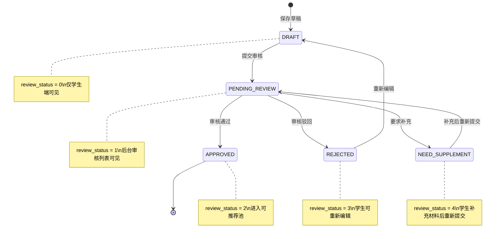

---

### 3.7 需求状态机

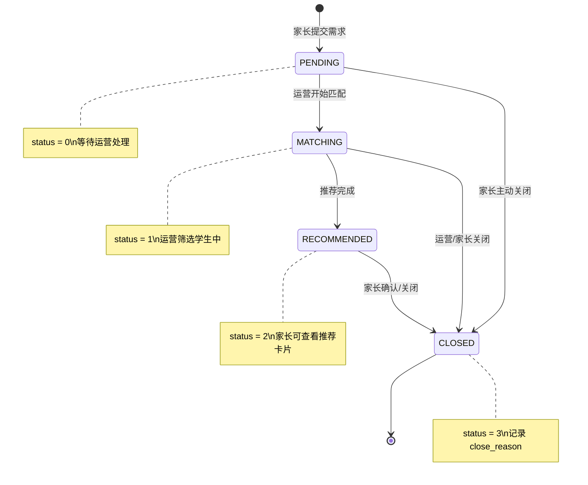

---

### 3.8 工单状态机

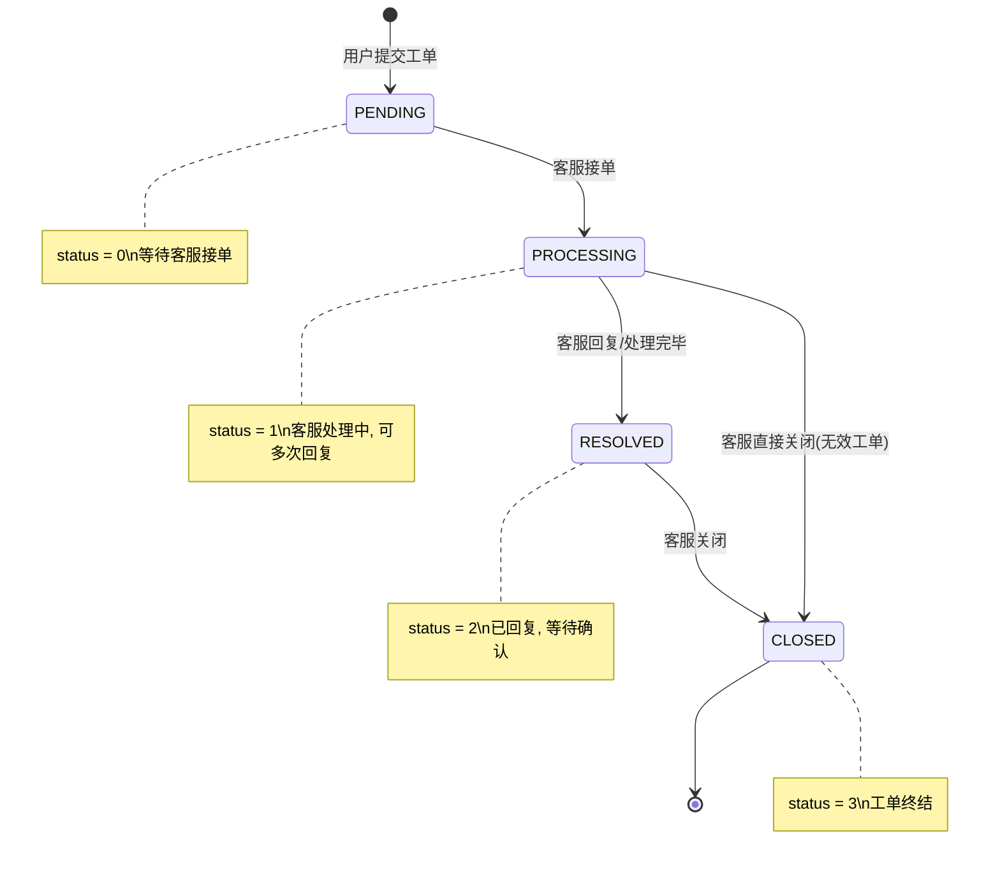

---

## 4. 跨端数据流转详情

### 4.1 需求-推荐-展示 全链路

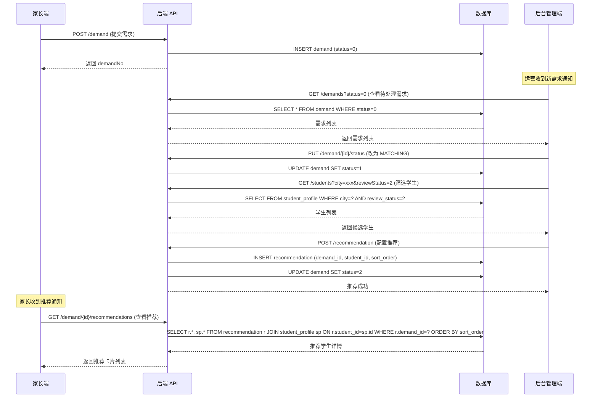

---

### 4.2 学生入驻审核 全链路

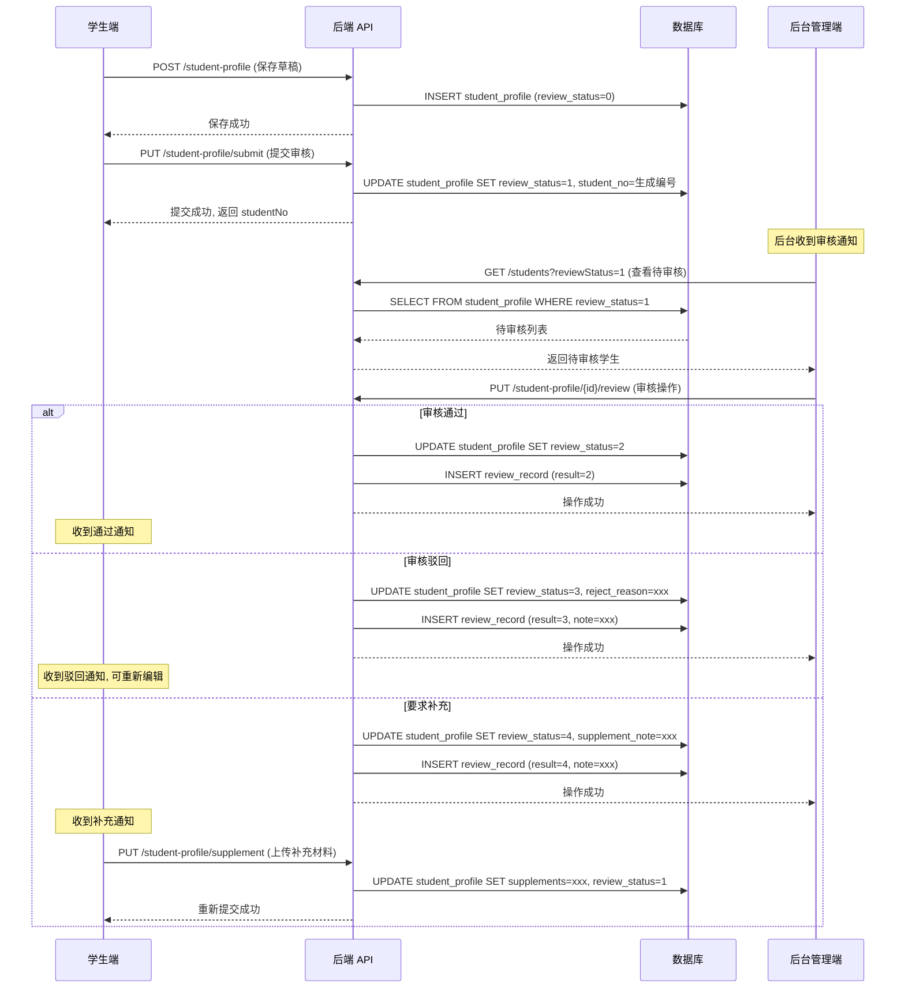

---

### 4.3 工单处理 全链路

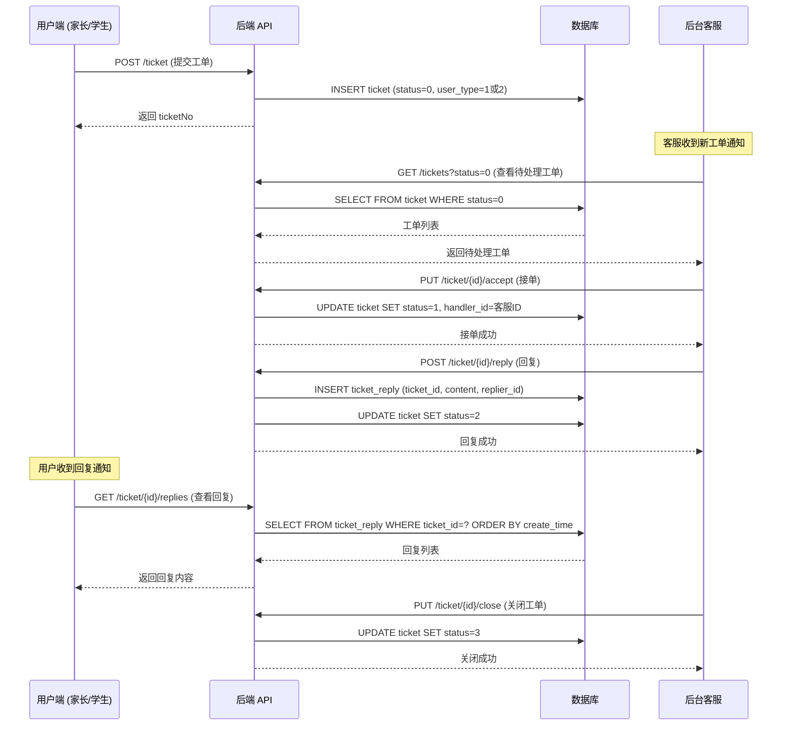

---

## 5. 数据权限与可见性

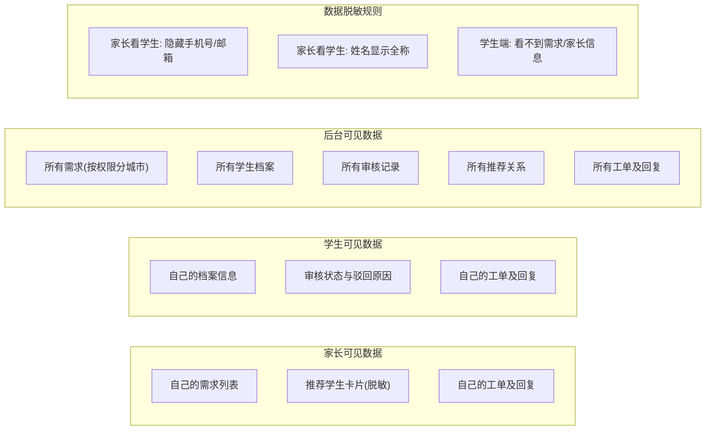

---

## 6. 关键业务规则汇总

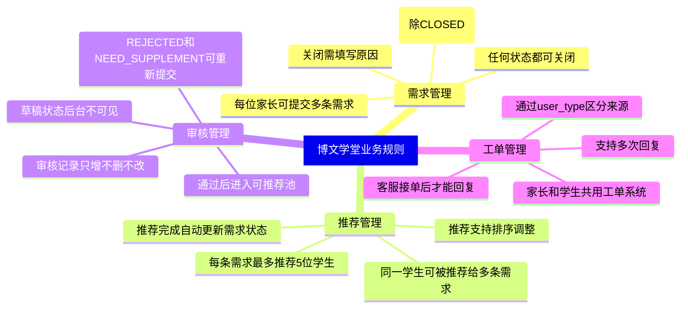
